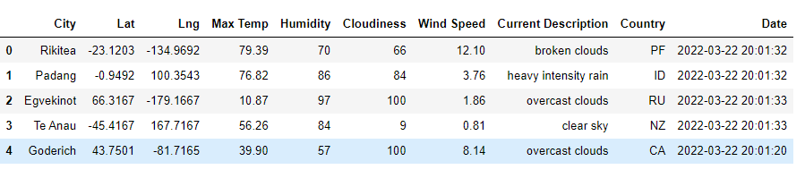
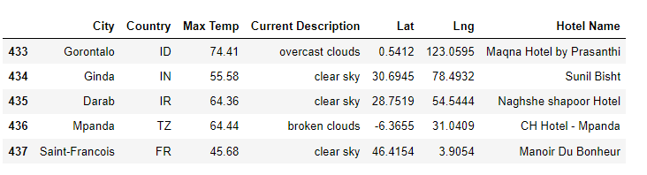
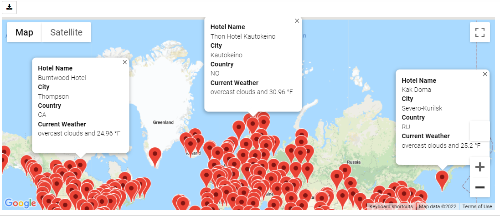
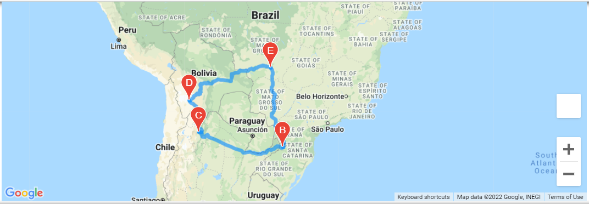
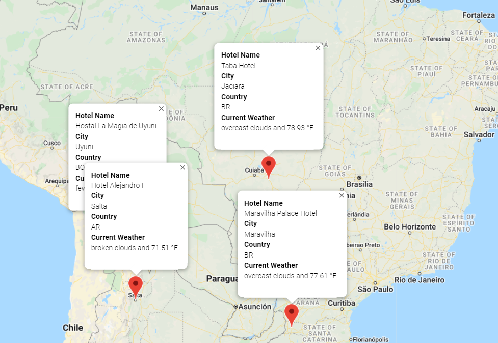

# World_Weather_Analysis


## Table of Contents
- [Project Overview](#OverviewProject)
  * [Background](#Background)
  * [Purpose](#purpose)
- [Weather Database](#Weather_Database)
- [Vacation Search](#Vacation_Search)
- [Vacation Itinerary](#Vacation_Itinerary)    
- [Resources](#resources)
- [References](#references)


## <a name="OverviewProject"></a>Project Overview
### <a name="Background"></a>Background
We can retrieve specific data from a website through an **Application Programming Interface** or **API**. API helps us to request data from a website or database server within the confines of the database rules. When we retrieve data from an API it is returned in a variety of formats. One of the most popular formats being **JSON (Java Script Object Notation)**. JSON has a heirarchial structure and stores meta data in multiple dictionaries or key:value pairs.
<p align="center">  </p>

### <a name="Purpose"></a>Purpose
**"Plan My Trip"** is a top travel technology company that specializes in internet related services in hotel and lodging industry. We will collect and present data for customers via the search page which they will then filter based on their preferred travel criteria in order to find their ideal hotel anywhere in the world. For this purpose I am using **Jupyter Notebook and Python CitiPy module** to get the cities from more than 500 random latitudes and longitudes. Then we perform requests on the **Open Weather Map API** and retrieve the JSON weather data for these cities. We map these cities using **Jupyter GMaps** and the **Google places API**. Next, we retrieve the nearby hotel information for the places selected by the user.

This project is divided into 3 parts:
1. **Weather Database** - We retrieve the weather information for cities generated by random latitudes and longitudes and store it in csv file.
2. **Vacation Search** - Here, we read the csv file with the weather information (generated in the "Weather Database") and filter the cities based on the weather preferences entered by the User. The search criteria will the be used to identify potential travel destinations and nearby hotels.  
3. **Vacation Itinerary** - Finally, from the list of potential travel destinations, the user will choose four cities to create a travel itinerary. Using the Google Maps Directions API, we will create a travel route between the four cities as well as a marker layer map.

 ## <a name="Weather_Database"></a>Weather Database
In this module, I used NumPy to generate 2000 random Latitudes and Longitudes, using the below line of code:
```
lats = np.random.uniform(low=-90.000, high=90.000, size=2000)
lngs = np.random.uniform(low=-180.000, high=180.000, size=2000)
```

For every latitude,longitude pair we retrieved the city name using the **citypy module**. Then using the **Open weathermap API** we retrieve the JSON weather information for each city and store the information in a csv file -  [WeatherPy_database.csv](Weather_Database/WeatherPy_database.csv)

Below is a snap shot of the output generated:

<p align="center">  </p>
 
 ## <a name="Vacation_Search"></a>Vacation Search
In this module, we read the weather data csv file into a Pandas dataframe. Based on the preference of the user for Max and Min temperartures, we filter the cities and the weather data. This is achieved by using the **loc** function as below:

```
preferred_cities_df = city_data_df.loc[(city_data_df["Max Temp"] >= user_min_temp) & 
                                   (city_data_df["Max Temp"] <= user_max_temp)]
```

We then retrieve the nearby Hotel information for the preferred cities using the **Google Maps API - Nearby Search** and store the final output in the csv file - [WeatherPy_vacation.csv](Vacation_Search/WeatherPy_vacation.csv) 

Below is a snap shot of the output generated:

<p align="center">  </p>

With the Jupyter gmaps module I plotted map with pop-up message that includes hotel name, city, country and weather information.

<p align="center">  </p>

 ## <a name="Vacation_Itinerary"></a>Vacation Itinerary
We first have to enable the "Directions API" in our Google account for the API key. 
In this module, we selected 4 destinations from the preferred cities and using the **Google Maps -Directions API** generated a route for them. We mapped these cities,and the route on the Google maps and also displayed the Hotel and the weather information for each. 


<p align="center">  </p>

With the Jupyter gmaps module I plotted map with pop-up message that includes hotel name, city, country and weather information.

<p align="center">  </p>


## <a name="resources"></a> Resources
[1] [Code for creating the Weather Database](Weather_Database/Weather_Database.ipynb) <br>
[2] [CSV file with Weather data](Weather_Database/WeatherPy_database.csv) <br>
[3] [Code for Vacation Search](Vacation_Search/Vacation_Search.ipynb) <br>
[4] [CSV file with Hotel Information](Vacation_Search/WeatherPy_vacation.csv)
[5] [Code for Vacation Itinerary](Vacation_Itinerary/Vacation_Itinerary.ipynb)  <br>

[6] Software: 
* Python 3.10.2
* Jupyter Notebook <br>

[7] Dependencies:
* Pandas Library
* Matplotlib Library
* Python CitiPy module
* Python Requests
[8] APIs
* **Open Weather APIs** to retrieve weather data.
* **Google Maps API** to create heat maps and retrieve information about hotels around the world.
* **Google Directions API** Enabled this API to map the direction between 4 points.


## <a name="references"></a> References
[OpenWeatherMap website](https://openweathermap.org/api)
[Google Maps Platform website](https://mapsplatform.google.com/)
[Documentation on Gmaps](https://jupyter-gmaps.readthedocs.io/en/latest/tutorial.html)
[Google Nearby Search requests page](https://developers.google.com/maps/documentation/places/web-service/search#PlaceSearchRequests%0D%0A)
[Place Types guide](https://developers.google.com/maps/documentation/places/web-service/supported_types)
[gmaps documentation on how to add markers](https://jupyter-gmaps.readthedocs.io/en/latest/tutorial.html#markers-and-symbols)


 
